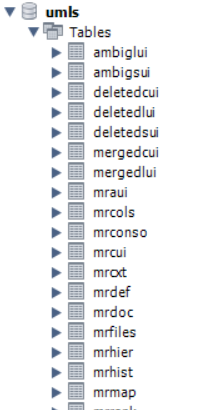

# Creating UMLS Knowledge Graph in Neo4j

The Unified Medical Language System (UMLS) is a comprehensive resource for biomedical terminologies and is used for linking diverse healthcare data sources. This guide will walk you through the process of creating a knowledge graph using the UMLS data in Neo4j.

## Install UMLS

1. Download `2024AB Full UMLS Release Files` in the [link](https://www.nlm.nih.gov/research/umls/licensedcontent/umlsknowledgesources.html)
2. Unzip **mmsys.zip** into the current folder.
3. Run **run64.bat** to start `MetamorphoSys` for customizing your UMLS subset. In our case we use the full English subset.

    Useful links:
    - [Overview](https://www.nlm.nih.gov/research/umls/new_users/online_learning/OVR_001.html)
    - [MetamorphoSys Help](https://www.nlm.nih.gov/research/umls/implementation_resources/metamorphosys/help.html)
    - [RRF files load manual](https://www.nlm.nih.gov/research/umls/implementation_resources/scripts/README_RRF_MySQL_Output_Stream.html)

## Load into MySQL

After installing all rrf files we need to load them into MySQL database. 

1. Create db in MySQL
2. Set environment variables

```bash
set MYSQL_HOME=
set user=root
set password=
set db_name=
```

3. Run this commands in UMLS directory powershell one by one.

- Create and load tables

```bash
echo Creating and loading tables... >> mysql.log 2>&1
%MYSQL_HOME%\bin\mysql -vvv -u %user% --password=%password% --local-infile=1 %db_name% < mysql_tables.sql >> mysql.log 2>>mysql_error.log
set ERRORLEVEL=%ERRORLEVEL%

IF %ERRORLEVEL% NEQ 0 (
    echo ERROR: Failed to create and load tables! >> mysql.log 2>&1
    echo MySQL Error Code: %ERRORLEVEL% >> mysql.log 2>&1
    echo ---- MySQL Error Log ---- >> mysql.log 2>&1
    type mysql_error.log >> mysql.log 2>&1
    set error=1
    goto trailer
)
```

- Create indices

```bash
echo Creating indexes... >> mysql.log 2>&1
%MYSQL_HOME%\bin\mysql -vvv -u %user% --password=%password% --local-infile=1 %db_name% < mysql_indexes.sql >> mysql.log 2>>mysql_error.log
set ERRORLEVEL=%ERRORLEVEL%

IF %ERRORLEVEL% NEQ 0 (
    echo ERROR: Failed to create indexes! >> mysql.log 2>&1
    echo MySQL Error Code: %ERRORLEVEL% >> mysql.log 2>&1
    echo ---- MySQL Error Log ---- >> mysql.log 2>&1
    type mysql_error.log >> mysql.log 2>&1
    set error=1
)
```

After this we wil get such results:<br>


## Load data from MySQL to Neo4j

1. To load data to Neo4j we need to retrieve concepts, atoms and relationships from MySQL database.<br>
    - Concepts are main medical terms.
    - Atoms are synonym or words with similar meaning to concepts.
    - Relationship are connections between concepts and atoms. <br>

2. To get csv's with concepts, atoms and relationships run this command:

```python
python retrieve_data.py --host ${host} --user ${user} --password ${password} --database ${database}
```

3. Before loading we need to create db in Neo4j. After that put this into config to load files from any directory:

```
dbms.directories.import=/path/to/your/custom/directory
```

To load csv's into Neo4j database run this command:

```python
python load_data.py --uri ${neo4j_uri} --username ${neo4j_username} --password ${neo4j_password} ${concepts_file} ${atoms_file} ${relationships_file}
```
